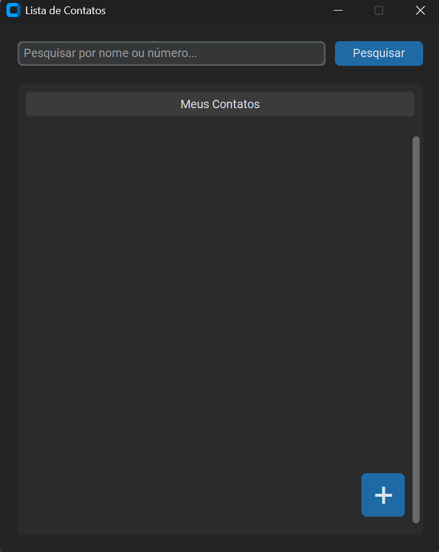
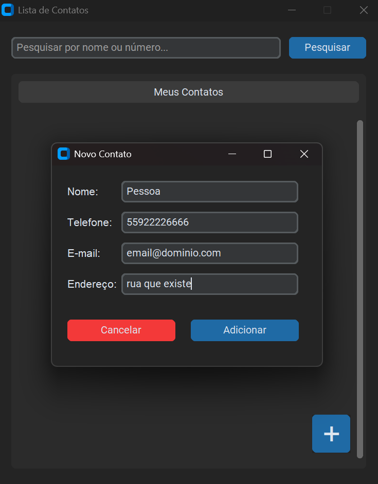
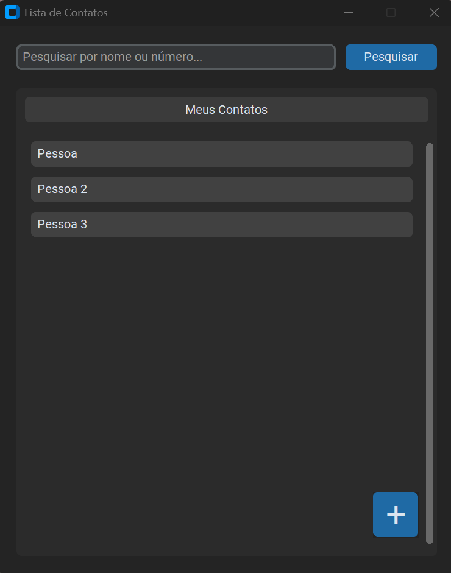

# Lista de Contatos em POO

Este projeto consiste em um CRUD (aplicação para cadastrar, consultar, editar e remover contatos) em CLI (aplicação em linha de comando) de uma lista de contatos. O projeto foi desenvolvido com o objetivo de praticar programação orientada a objetos, persistência em JSON e testes automatizados com pytest.

## Funcionalidades

- [x] Cadastrar contatos
- [x] Listar contatos em ordem alfabética
- [x] Buscar contatos pelo nome
- [x] Editar contatos
- [x] Remover contatos
- [x] Salvar os dados em JSON
- [x] Interface gráfica em CustomTkinter
- [ ] Substituir a persistencia em JSON para SQlite ou MySQL

## Conceitos praticados

- Programação orientada a objetos
- Encapsulamento
- Composição de objetos
- Separação de responsabilidades
- Tratamento de exceções
- Manipulação de arquivos JSON
- Testes automatizados
- Injeção de dependência
- Manipulação de interface gráfica


## Tecnologias

- Python 3.14
- Rich
- pytest
- CustomTkinter


## Estrutura do projeto

```text
lista_de_contatos_poo/
├── lista_contatos/
│   ├── __init__.py
│   ├── agenda.py
│   ├── contato.py
│   ├── interface.py
│   └── repositorio.py
├── testes/
│   ├── test_agenda.py
│   ├── test_contato.py
│   └── test_repositorio.py
├── .gitignore
├── main.py
├── pyproject.toml
├── requirements.txt
└── README.md
```

### Responsabilidades principais

- `Contato`: representa e valida os dados de um contato.
- `Agenda`: executa as regras de cadastro, busca, edição e remoção.
- `RepositorioJson`: carrega e salva os contatos em um arquivo JSON.
- `main.py`: apresenta o menu e recebe os dados digitados pelo usuário.

## Pré-requisitos

- Python 3.11 ou superior
- Git


## Instalação

Clone o repositório.
Crie um ambiente virtual.

### Windows

```powershell
py -m venv .venv
.venv\Scripts\activate
```

### Linux ou macOS

```bash
python3 -m venv .venv
source .venv/bin/activate
```

Instale as dependências. 

```bash
python -m pip install -e ".[dev]"
```


## Como executar

```bash
python main.py
```


## Como executar os testes

```bash
python -m pytest
```

Para exibir a cobertura, caso `pytest-cov` esteja instalado:

```bash
python -m pytest --cov=lista_contatos --cov-report=term-missing
```

## Exemplo de uso

Interface inicial


Adicionando contato


Exibição dos contatos adicionados


## Decisões de projeto

- A classe `Agenda` não acessa arquivos diretamente.
- A persistência foi isolada em `RepositorioJson`.
- O caminho do arquivo é recebido pelo repositório, permitindo o uso de
  diretórios temporários nos testes.
- A interface depende da `Agenda`, mas a `Agenda` não
  depende da interface.

## Limitações conhecidas

- Busca não ordena os resultados por similaridade da busca
- Não é possível buscar por telefone
- Ainda não realizado o tratamento de erros de execução da interface


## Próximos passos

- [x] Criar um contrato comum para os repositórios
- [x] Implementar um repositório em memória para testes
- [ ] Substituir a persistência JSON por SQLite
- [ ] Adicionar testes de integração da interface
- [ ] Disponibilizar as operações por meio de uma API

## Aprendizados

A estruturação de um projeto e separação de funções foi o principal foco da aprendizagem. Apesar da novidade pessoal da programação orientada a objetos a sua utilidade e potencialidade ficou muito clara no projeto, simplificação do código principal, independencia completa de trechos de código em comparação a códigos procedurais, capacidade de alterar comportamentos de classes sem afetar substancialmente outros trechos do código. A principal dificuldade no desenvolvimento do projeto foi na sua arquitetura e idealização, para isso, foi utilizado auxilio de ferramentas de IA (ChatGPT e Gemini) para orientação da estrutura do projeto, arquivos sugeridos e divisão de funções. 

## Autor

Breno Barbosa da Cunha

- GitHub: [BrenoBCunha](https://github.com/BrenoBCunha)


